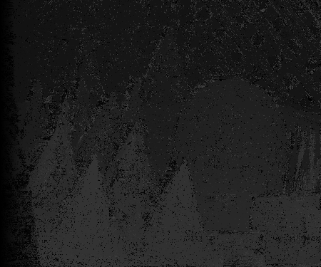
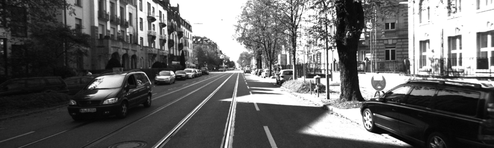
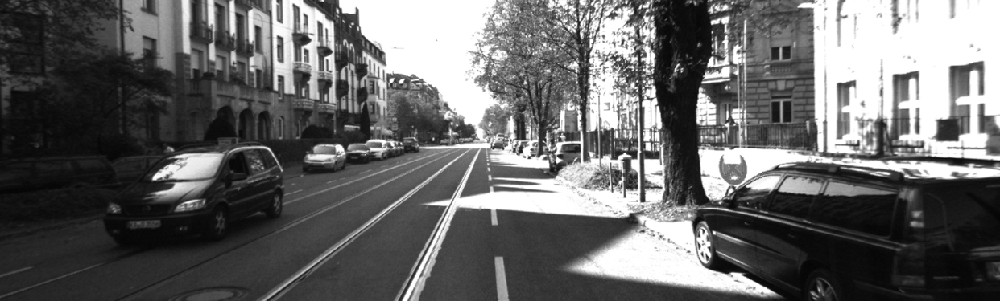
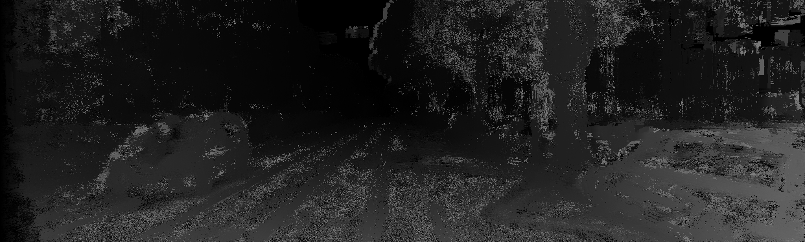
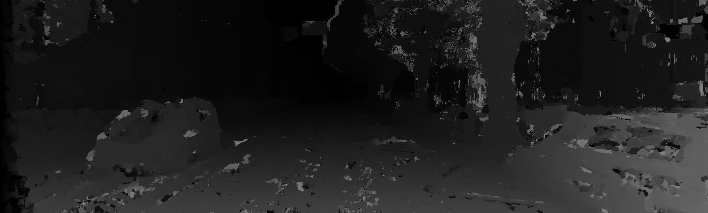
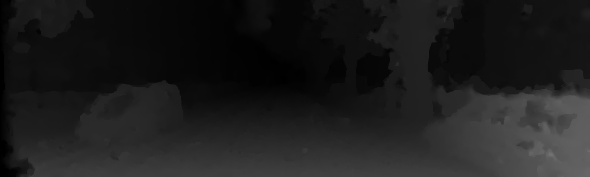
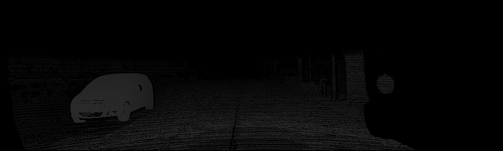
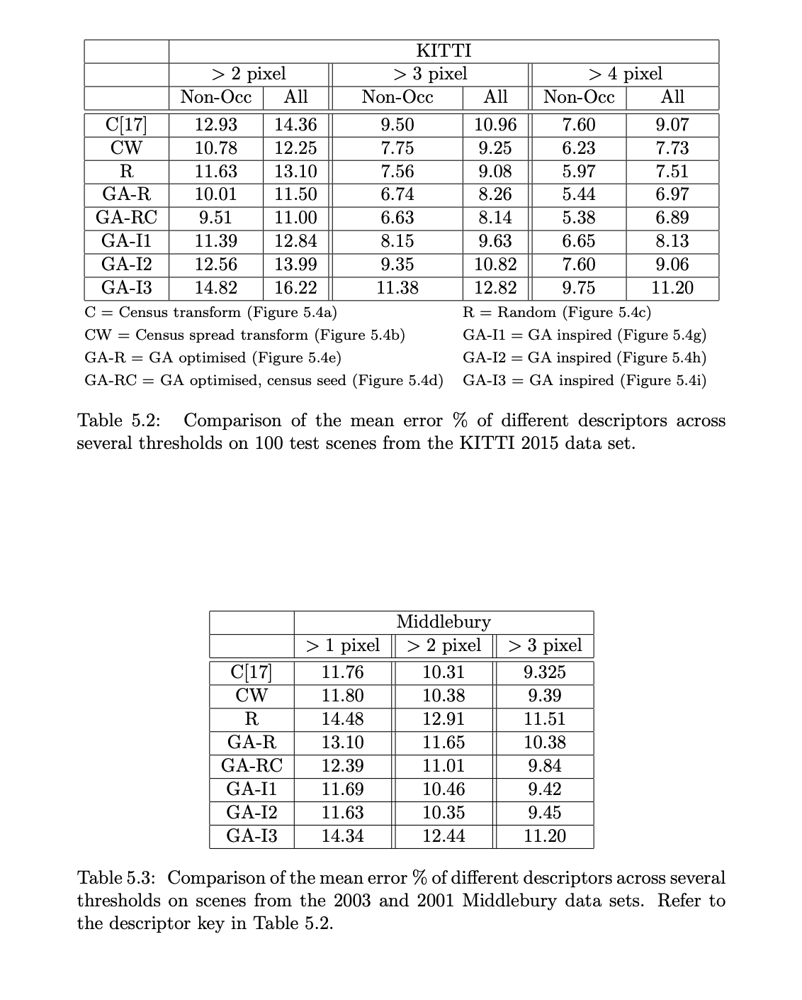

# Stereo implementation of total generalized variation (TGV) on GPU

This is a CUDA C implementation of [Fast and Accurate Large-Scale Stereo Reconstruction Using Variational Methods [2]](https://www.cv-foundation.org/openaccess/content_iccv_workshops_2013/W21/html/Kuschk_Fast_and_Accurate_2013_ICCV_paper.html) and is supplied as part of the supplementary material to my honours thesis. To my knowledge this is the only open source implementation of stereo TGV. Results below are from the first scene in the [2015 KITTI stereo evaluate data set](http://www.cvlibs.net/datasets/kitti/eval_scene_flow.php?benchmark=stereo).

|  |
|:--:|
| *Animation of disparity images from each iteration of TGV's gradient descent* |

|  |
|:--:|
| *Animation of disparity images from each iteration of TGV's gradient descent* |


**Key:**
+ MC = Matching costs
+ CA = Cost aggregation[2]
+ TGV = Total generalized variation[1]

<table>
  <tr><td>Left image</td><td></td></tr>
  <tr><td>Right image</td><td></td></tr>
  <tr><td>Estimated disparity image<br /> <strong>MC</strong></td><td></td></tr>
  <tr><td>Estimated disparity image<br /> <strong>MC+CA</strong></td><td></td></tr>
  <tr><td>Estimated disparity image<br /> <strong>MC+CA+TGV</strong></td><td></td></tr>
  <tr><td>Ground truth disparity image</td><td></td></tr>
</table>

# Requirements

+ CUDA
+ CMake
+ Optional: ImageMagic to convert `.pgm` to `.png` -> `mogrify -format png *.pgm`


# Usage

```bash
# Build
mkdir build
cd build
cmake ../
make

# Binary descriptor representation of census transform on a 7x7 window
export CENSUS_DESCRIPTOR="90,144,91,144,92,144,93,144,94,144,95,144,\
96,144,107,144,108,144,109,144,110,144,111,144,112,144,113,144,124,144,\
125,144,126,144,127,144,128,144,129,144,130,144,141,144,142,144,143,144,\
144,144,145,144,146,144,147,144,158,144,159,144,160,144,161,144,162,144,\
163,144,164,144,175,144,176,144,177,144,178,144,179,144,180,144,181,144,\
192,144,193,144,194,144,195,144,196,144,197,144,198,144,144,144,144,144,\
144,144,144,144,144,144,144,144,144,144,144,144,144,144,144,144,144,144,\
144,144,144,144,144,144,144,144"

# Usage:
# ./matching <left image> <right image> \
#   <estimated disparity image> <encoded binary descriptor> \
#   <max disparity> <disparity multiplyer>

# Pipeline:
# 1. Matching costs
# 2. Cost Aggregation[2]
# 3. TGV[1]
./matching ../kitti/reference.pgm ../kitti/target.pgm ../out.pgm \
  $CENSUS_DESCRIPTOR 128 1
```

# Limitations

+ The upper bound for the max disparity is 256. This can be increased by modifying the shared memory buffers of size 256 in [selection-functions.cu](src/selection-functions.cu).
+ Only greyscale `.pgm` format files can be used for input and output.
+ TGV parameter sets are specified at compile time. They are defined in [selection-functions.cu](src/selection-functions.cu).
```c++
...
// [1] mentions for low resolution Middleburry use λd=1.0 and λs=0.2
#define LAMBDA_S 0.2f
#define LAMBDA_A (8.0f * LAMBDA_S)
#define LAMBDA_D 1.0f
...
// [1] mentions for 2015 kitti use λd=0.4 and λs=1.0
#define LAMBDA_S 1.0f
#define LAMBDA_A (8.0f * LAMBDA_S)
#define LAMBDA_D 0.4f
...
```

# Descriptors

Part of my research was learning binary descriptors using genetic algorithms (GAs) for use in stereo matching. The defenition of the some descriptors from the paper are listed here.



### 1. Census (C)

<table>
  <tr>
    <td>
      <br/>
      <strong>KITTI 3px thresh err:</strong> 10.96%
    </td>
    <td><pre><code>export CENSUS_DESCRIPTOR="90,144,91,144,92,144,93,144,94,144,95,144,\
    96,144,107,144,108,144,109,144,110,144,111,144,112,144,113,144,124,144,\
    125,144,126,144,127,144,128,144,129,144,130,144,141,144,142,144,143,144,\
    144,144,145,144,146,144,147,144,158,144,159,144,160,144,161,144,162,144,\
    163,144,164,144,175,144,176,144,177,144,178,144,179,144,180,144,181,144,\
    192,144,193,144,194,144,195,144,196,144,197,144,198,144,144,144,144,144,\
    144,144,144,144,144,144,144,144,144,144,144,144,144,144,144,144,144,144,\
    144,144,144,144,144,144,144,144"</code></pre></td>
  </tr>
</table>

### 2. GA optimized (GA-R)

<table>
  <tr>
    <td>
      <br/>
      <strong>KITTI 3px thresh err:</strong> 8.26%
    </td>
    <td><pre width="200"><code class="bash">export GA_R_DESCRIPTOR=131,135,90,210,93,244,253,168,158,162,104,36,\
    122,61,252,260,162,106,106,42,204,18,70,37,29,180,13,44,108,103,84,284,\
    156,170,202,30,82,167,165,141,37,108,253,179,129,125,287,12,128,275,154,\
    107,42,145,7,89,215,244,235,231,127,21,86,123,175,205,280,285,78,49,52,\
    46,155,161,88,98,51,44,278,178,145,163,99,112,185,176,93,117,98,96,223,\
    71,63,94,170,176,108,238,287,30,125,74,203,96,82,48,191,125,157,150,36,\
    62,85,124,84,79,104,102,275,189,46,60,65,184,190,154,159,40</code></pre></td>

  </tr>
</table>


### 3. GA optimized, census seed (GA-RC)

<table>
  <tr>
    <td>
      <br/>
      <strong>KITTI 3px thresh err:</strong> 8.14%
    </td>
    <td><pre width="200"><code class="bash">export GA_RC_DESCRIPTOR=90,144,91,144,92,144,93,144,94,144,95,144,96,\
    144,107,144,119,27,84,50,1,94,160,166,84,132,264,237,186,77,259,180,209,\
    204,195,43,188,136,91,86,254,248,85,11,126,149,111,61,27,40,203,283,119,\
    124,87,36,84,152,246,180,241,25,11,58,195,187,112,181,88,156,203,162,271,\
    279,102,20,230,138,140,123,153,121,54,62,155,222,151,135,165,152,109,128,\
    145,143,120,280,221,104,98,101,107,104,168,142,170,124,4,76,126,148,147,\
    99,152,197,70,74,119,228,247,193,22,6,210,145,161,218,113,103</code></pre></td>

  </tr>
</table>


# Related Publications

+ [1] Georg Kuschk and Daniel Cremers. 2013. [_"Fast and accurate large-scale stereo reconstruction using variational methods"_](https://www.cv-foundation.org/openaccess/content_iccv_workshops_2013/W21/html/Kuschk_Fast_and_Accurate_2013_ICCV_paper.html). In: Proceedings of the IEEE International Conference on Computer Vision Workshops pp. 700-707.
+ [2] Kuk-Jin Yoon and In So Kweon. 2006. [_"Adaptive support-weight approach forcorrespondence searc"_](). In: IEEE Transactions on Pattern Analysis and Machine Intelligence 28.4 (2006), pp. 650-656.

# What to cite

The paper related to this work has not been published yet. If you use this code in your research please cite:

```
@misc{milson2018,
  author = {Andrew Milson},
  title = {GPU Total Generalized Variation Stereo},
  year = {2018},
  publisher = {GitHub},
  journal = {GitHub repository},
  howpublished = {\url{https://github.com/andrewmilson/total-generalized-variation-stereo-matching-pipeline}},
}
```
